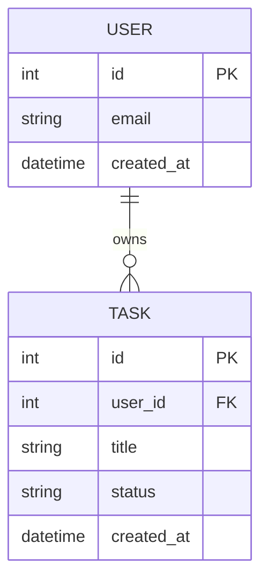

# ERD (Draft)

```mermaid
erDiagram
    USER ||--o{ TASK : owns
    USER {
      int id PK
      string email
      datetime created_at
    }
    TASK {
      int id PK
      int user_id FK
      string title
      string status
      datetime created_at
    }
```
